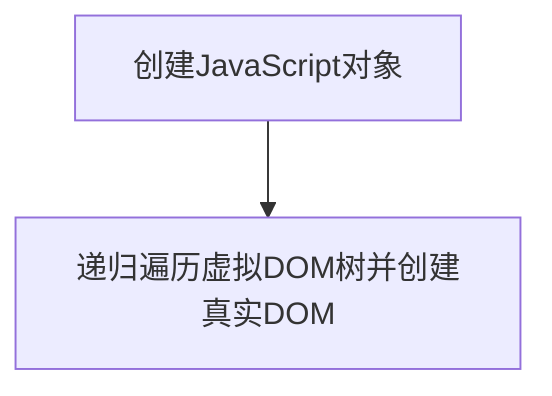

# 虚拟DOM

## 引言

在我上一篇笔记[Vue.js视图层框架设计-命令式与声明式](https://juejin.cn/post/7067435977391734792)中谈到Vue.js在视图层框架设计中采用的是命令式内部实现+声明式外部暴露的构建方案，那么就存在一个摆在明面上的问题：选择了尽可能地把声明式暴露给用户，那么对性能必定会有所影响，即**声明式代码的更新消耗 = 找出差异的性能消耗 + 直接修改的性能消耗（命令式）**。到此，如何尽可能地降低**找出差异的性能消耗**成为迫切需要解决的问题，Vue.js设计团队给出的方案就是**虚拟DOM**！

## 什么是虚拟DOM

在前端领域，DOM指的是**文档对象模型**，是HMTL和XML文档的编程接口，提供了一种对文档的结构化表述。而虚拟DOM简言而之，就是用JavaScript仿照DOM结构实现的一种树形结构对象，如[Vue.js官方文档](https://vuejs.org/api/render-function.html#h)中写明的渲染函数`h()`就实现了创建虚拟DOM节点的功能，如下：

## 虚拟DOM与innerHTML的性能比较

### 创建页面时的性能比较

#### 虚拟DOM

虚拟DOM在创建页面的过程中分为两步：

用一个公式来表示使用虚拟DOM创建页面的性能：**创建JavaScript对象的计算量 + 创建真实DOM的计算量**

#### innerHTML

使用`innerHTML`创建页面的代码如下：

看起来简单吧？可是这段代码的内部实现可没看起来的这么简单。为了渲染出页面，首先要把字符串解析成DOM树，这可是一个DOM层面的计算操作，比纯JavaScript层面的操作要慢上许多。

用一个公式来表示通过`innerHTML`创建页面的性能：**HTML字符串拼接的计算量 + innerHTML的DOM计算量**

#### 图表对比

|  | 虚拟DOM | innerHTML |
| --- | --- | --- |
| 纯JavaScript运算 | 创建JavaScript对象（VNode） | 渲染HTML字符串 |
| DOM运算 | 新建所有DOM元素 | 新建所有DOM元素 |

**可见，从宏观的角度上看，在创建页面时各方法的性能差别不大**

### 更新页面时的性能比较

> *更新页面是在创建页面的基础上进行选择性的替换*

#### 虚拟DOM

- 重新创建JavaScript对象（虚拟DOM树）
- 调用Diff算法找到变化的元素并更换

#### innerHTML

- 重新构建HTML字符串
- 重新设置DOM元素的`innerHTML`属性

#### 图表对比

|  | 虚拟DOM | innerHTML |
| --- | --- | --- |
| 纯JavaScript运算 | 创建新的JavaScript对象+Diff | 渲染HTML字符串 |
| DOM运算 | 必要的DOM更新 | 销毁所有旧DOM并新建所有新DOM |
| 性能因素 | 与数据的变化量有关 | 与模板大小有关 |

对于虚拟DOM来说，只需要更新变化的元素，而对于使用`innerHTML`来说，需要删除所有旧DOM并新建所有新DOM，而且性能上的消耗随模板的增大而越来越大，这时，虚拟DOM的优势就体现出来了。

## 总结

Vue.js采用虚拟DOM是在各方面平衡的结果，既降低了用户的学习成本与使用成本（写声明式代码），还保证了应用程序的性能下限，让应用程序的性能不至于太差，甚至尽可能地逼近命令式代码的性能

各方案性能由高到低如下：
- 原生JavaScript（心智负担大、可维护性差、性能高）
- 虚拟DOM（心智负担小、可维护性强、性能不错）
- innerHTML模板（心智负担中等、性能差）

## 参考资料

- [掘金文章-神奇的虚拟DOM](https://juejin.cn/post/6844903806132568072#heading-1)
- [MDN-DOM概述](https://developer.mozilla.org/zh-CN/docs/Web/API/Document_Object_Model/Introduction)